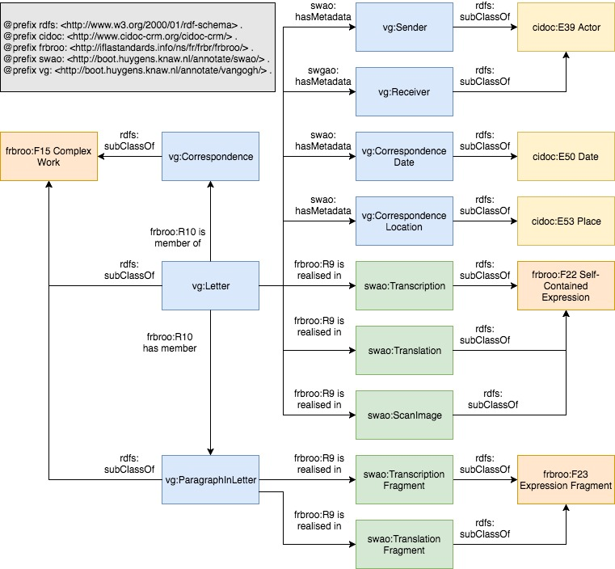

# The Scholarly Web Annotation Ontology

The Scholarly Web Annotation client uses RDFa reason about the page it is annotating. A page can use any Semantic Web ontology to describe itself, but for some specific scholarly goals, there is an annotation ontology that the client can use for special functionalities. 

The Scholarly Web Annotation Ontology (SWAO) extends the FRBRoo and CIDOC-CRM ontologies, so that scholars can differentiate between conceptual levels of the resources presented on a page and choose which level they want to annotate. E.g. it is possible to describe a resource both at the level of a work, or a specific manifestation or expression of it. For instance, when annotating a letter that is part of correspondence, scholars may want to annotate a phrase in the text to say something about the letter in general, or about some aspect of the specific transcription or translation.

The FRBRoo ontology is very extensive, and in many cases only a few of the concepts will be relevant, so we demonstrate how our SWA Ontology connects to some of the basic concepts of FRBRoo related to *Works*. 

## Extending the ontology

It is possible to extent the SWA Ontology with further concepts from FRBRoo or CIDOC/CRM to describe resources or aspects of resource that are of interest for a specific scholarly use case. 

## AnnotatableThing, FRBRoo and CIDOC/CRM

The screenshots below demonstrate how resources can be described as annotatable concepts related to FRBRoo and CIDOC/CRM. All examples are based on the following definitions:

- [Definition of FRBRoo v2.4](https://www.ifla.org/files/assets/cataloguing/FRBRoo/frbroo_v_2.4.pdf)
- [Definition of CIDOC/CRM v6.1](http://www.cidoc-crm.org/Version/version-6.1)


*Figure 1. Example of a digital edition of a Letter by Vincent van Gogh, described by FRBRoo concepts of Complex Work, Individual Work, Expression Creation and Self-Contained Expression.* 

The example in Figure 1 shows that a full description of the realisations of each work results in a very complex graph. The letter is part of a correspondence of multiple letters, which makes the correspondence a complex work. But the letter itself consists of multiple creative works. The abstract content of the original work is an individual work, but each transcription and each translation is itself also a creative work, that an annotation might refer to. 

This would need a complex HTML structure to capture in RDFa, and most layers would be deemed irrelevant for scholarly annotation purposes and would potentially confuse users. The example is merely to show that, if necessary, many aspects of the realisation of a work can be captured and made available for annotation. 

For many use cases, a simpler model would suffice. Below is an example of a single letter of van Gogh, as part of the entire van Gogh correspondence, with metadata aspects, individual paragraphs, transcription and translation. This uses the SWA Ontology and a specific van Gogh extension of that ontology.



*Figure 2. Example of a digital edition of a Letter by Vincent van Gogh, connected to the FRBRoo concepts of Complex Work, Individual Work, Self-Contained Expression and CIDOC/CRM concepts of Actor, Date and Place.* 

Adding RDFa for individual expressions allows scholars to refer to them as separate resources or as a single resource. E.g. if a scholar wants to use an annotation to indicate that a particular transcription contains a mistake, the scholar wants to be able to refer to the text containing the mistake at the level of the transcription. If the scholar instead wants to annotate the same piece of text with a comment about Vincent van Gogh’s writing, the annotation should refer to the abstract content of the original letter.

The reason to use different conceptual levels is that the digital edition may want to treat them differently. For instance, a digital edition may wish to show annotations on the abstract content of the original letter with every expression of it, e.g. with its transcription in Dutch as well as with its translation to English. The same digital edition may wish to show an annotation about a mistake in the English translation only with that particular translation.

Below is an example in HTML that demonstrates how different conceptual levels can be exploited in RDFa-based annotation:

```xhtml

<div about=”urn:vangogh:letter001” vocab=”http://boot.huygens.knaw.nl/annotate/vangogh_ontology.ttl#” typeof=”letter”>
	<div resource=”urn:vangogh:letter001:transcription” typeof=”Transcription” property=”R9_is_realised_in”>
		<div resource=”urn:vangogh:letter001:p.1:transcription” typeof=”TranscriptionFragment” property=”R15_has_fragment”>
			<div resource=”urn:vangogh:letter001:p.1” typeof=”ParagraphInLetter” property=”R9_is_realisation_of”>
					Waarde Theo,
			</div>
		</div>
		<div resource=”urn:vangogh:letter001:p.2:transcription” typeof=”TranscriptionFragment” property=”R15_has_fragment”>
			<div resource=”urn:vangogh:letter001:p.2” typeof=”ParagraphInLetter” property=”R9_is_realisation_of”>
					Dank voor je brief, het deed mij genoegen dat je weer goed aangekomen zijt.
			</div>
		</div>
	</div>
	<div resource=”urn:vangogh:letter001:translation” typeof=”Translation” property=”R9_is_realised_in”>
		<div resource=”urn:vangogh:letter001:p.1:translation” typeof=”TranslationFragment” property=”R15_has_fragment”>
			<div resource=”urn:vangogh:letter001:p.1” typeof=”ParagraphInLetter” property=”R9_is_realisation_of”>
					Dear Theo,
			</div>
		</div>
		<div resource=”urn:vangogh:letter001:p.2:translation” typeof=”TranslationFragment” property=”R15_has_fragment”>
			<div resource=”urn:vangogh:letter001:p.2” typeof=”ParagraphInLetter” property=”R9_is_realisation_of”>
					Thanks for your letter, I was glad to hear that you got back safely.
			</div>
		</div>
	</div>
</div>

```


## Special features of the SWA Ontology

There are two special concepts that affect how the SWA client behaves for identifying elements that should be unselectable or only selectable as a whole. 

### Atomic Content Elements

You may want to consider certain aspects of a resource to be atomic, such as metadata properties, that should only be annotatable as a whole. If you don’t want users to be able to select and annotate fragments of these atomic units, you can wrap them in an HTML element and add the `SelectWholeElement` property. When a user selects a fragment of such an element, the SWA client will automatically expand the selection to the entire element.

Typical elements to select as a whole are metadata properties, e.g.:

```xhtml
<div typeof=”Sender” resource=”urn:vangogh:letter001.sender” property=”hasMetadataItem”>
	<span property=”SelectWholeElement”>Vincent van Gogh</span>
</div>
```


### Ignorable Elements

A web page that presents a resource often contains additional content that is not related or relevant to the resource and that should not be annotatable. The SWA Ontology contains the concept `IgnoreableElement` that the SWA client will make unselectable.

Typical elements to ignore are labels, e.g.:

```xhtml
<div typeof=”Sender” resource=”urn:vangogh:letter001.sender” property=”hasMetadataItem”>
	<label typeof=”IgnorableElement”>Sender:</label>
	<span property=”SelectWholeElement”>Vincent van Gogh</span>
</div>
```

### Ignorable Tags

Some elements have relevant content, but the tags

## Elements of the AnnotatableThing Ontology

*TO DO: image of ontology*

```
@prefix owl: <http://www.w3.org/2002/07/owl#> .
@prefix rdf: <http://www.w3.org/1999/02/22-rdf-syntax-ns#> .
@prefix rdfs: <http://www.w3.org/2000/01/rdf-schema#> .
@prefix xsd: <http://www.w3.org/2001/XMLSchema#> .
@prefix skos: <http://www.w3.org/2004/02/skos/core#> .
@prefix cidoc: <http://erlangen-crm.org/current/> .
@prefix frbroo: <http://iflastandards.info/ns/fr/frbr/frbroo/> .
@prefix oa: <http://www.w3.org/ns/oa#> .

<http://boot.huygens.knaw.nl/annotate/swao.ttl#> a owl:Ontology .

swao:Transcription rdf:type owl:Class ;
	rdfs:label "Transcription" ;
	rdfs:subClassOf frbroo:F22_Self-Contained_Expression.

swao:Translation rdf:type owl:Class ;
	rdfs:label "Translation" ;
	rdfs:subClassOf frbroo:F22_Self-Contained_Expression.

swao:ScanImage rdf:type owl:Class ;
	rdfs:label "ScanImage" ;
	rdfs:subClassOf frbroo:F22_Self-Contained_Expression.

swao:TranscriptionFragment rdf:type owl:Class ;
	rdfs:label "TranscriptionFragment" ;
	rdfs:subClassOf frbroo:F23_Expression_Fragment.

swao:TranslationFragment rdf:type owl:Class ;
	rdfs:label "TranslationFragment" ;
	rdfs:subClassOf frbroo:F23_Expression_Fragment.

swao:hasMetadata rdf:type owl:ObjectProperty ;
	rdfs:domain frbroo:F1_Work;
	rdfs:range cidoc:Entity;
	rdfs:label "hasMetadata"  ;
	rdfs:comment "Indicates a metadata property of a resource";
	rdfs:subPropertyOf swao:includes.

swao:includes rdf:type owl:ObjectProperty ;
	rdfs:domain frbroo:F1_Work;
	rdfs:range frbroo:F1_Work;
	rdfs:label "includes" ;
	rdfs:comment "Superproperty for all relations that are considered hierarchical".

swao:selectWholeElement rdf:type owl:DatatypeProperty ;
	rdfs:domain swao:AnnotatableThing ;
	rdfs:range xsd:boolean;
	rdfs:label "hasType" ;
	rdfs:comment "Selecting part of element is not possible".

swao:IgnorableElement rdf:type owl:Class ;
	rdfs:label "IgnorableElement" ;
	rdfs:subClassOf swao:AnnotatableThing ;
	rdfs:comment "Element should be ignored in annotation".

swao:IgnorableTag rdf:type owl:Class ;
	rdfs:label "IgnorableContent" ;
	rdfs:subClassOf swao:AnnotatableThing ;
	rdfs:comment "Tags of element should be ignored in annotation (content is relevant)".

```

